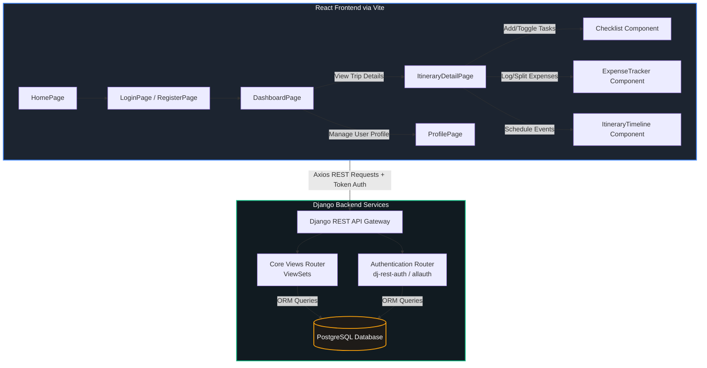

# GoTrack 🌍

GoTrack is a comprehensive, full-stack travel itinerary planner designed to help users organize their adventures seamlessly. From managing budgets and scheduling daily activities to tracking travel essentials and accommodations, GoTrack serves as your digital companion for every trip.

Built with a modern **React.js frontend** and a secure **Django REST Framework (DRF) backend**, the application provides a highly cohesive user experience styled around an elegant, earth-toned design system.

---

## 📸 Key Features

- 📊 **Personalized Dashboard**: View and manage all your upcoming and past trips in one cohesive, themed interface.
- 📅 **Itinerary Timeline**: Plan your days with precision. Seamlessly add activities, transport legs, and accommodation check-ins.
- 💳 **Smart Expense Tracker**: Keep travel budgets under control with real-time expense logging, categorized entries, and multiple currency support (default: `INR`).
- 🎒 **Travel Checklist**: Never forget your passport, charger, or essentials again with a built-in packing and task checklist.
- 🔐 **Secure Authentication**: Robust user registration, login systems, and token-based security powered by `dj-rest-auth` to ensure private travel data.
- 👤 **Profile Management**: Customize and manage your personal user details and contact information.

---

## 📐 System Architecture

The following block diagram represents the architecture and client-server communication flow for GoTrack:



---

## 🔌 Setup & Installation

### 1. Prerequisites

Ensure you have the following installed on your local machine:
- **Python 3.10+**
- **Node.js 18+ & npm**
- **PostgreSQL 14+**

### 2. Database Initialization
Create a PostgreSQL database named `travel_planner` (or configure settings inside [settings.py](file:///c:/Users/asray/Downloads/travel_itinerary-main/travel_itinerary-main/backend/planner/settings.py) to match your environment):
```sql
CREATE DATABASE travel_planner;
```

### 3. Backend Installation
Navigate to the `backend` directory and set up a virtual environment:
```bash
# Navigate to backend directory
cd backend

# Create a virtual environment
python -m venv venv

# Activate virtual environment
# On Windows:
venv\Scripts\activate
# On macOS/Linux:
source venv/bin/activate

# Install python dependencies
pip install -r requirements.txt

# Apply database migrations
python manage.py migrate
```

### 4. Frontend Installation
Navigate to the `frontend` directory and install local packages:
```bash
# Navigate to frontend directory
cd ../frontend

# Install dependencies
npm install
```

---

## 🏃 How to Run the System

### Step 1: Start the Backend Server
Make sure your PostgreSQL server is active, and launch the Django development server:
```bash
# From the backend directory (ensure virtual environment is active)
python manage.py runserver
```
*The Django API will be served at `http://localhost:8000`.*

### Step 2: Start the Frontend Application
Launch the Vite React development server:
```bash
# From the frontend directory
npm run dev
```
*The frontend application will run at `http://localhost:5173`.*

---

## 🌐 API Reference

GoTrack exposes a set of RESTful endpoints under the `/api` prefix, with authentication enforced via Token Headers (`Authorization: Token <key>`).

### User Account & Authentication
- **`POST /api/auth/registration/`**: Registers a new user account.
- **`POST /api/auth/login/`**: Exchages credentials for an authentication token.
- **`POST /api/auth/logout/`**: Invalidates the active token session.
- **`GET /api/auth/user/`**: Retrieves profile details of the authenticated user.
- **`PUT/PATCH /api/auth/user/`**: Updates personal info on the authenticated user profile.

### Trips
- **`GET /api/trips/`**: Retrieves a list of all trips owned by the authenticated user.
- **`POST /api/trips/`**: Creates a new trip listing.
- **`GET/PUT/PATCH/DELETE /api/trips/<id>/`**: Manages a specific trip's details.

### Accommodations
- **`GET /api/accommodations/`**: Lists accommodation check-ins for the user's trips.
- **`POST /api/accommodations/`**: Records a lodging booking.
- **`GET/PUT/PATCH/DELETE /api/accommodations/<id>/`**: Manages a specific accommodation.

### Transportation
- **`GET /api/transportation/`**: Lists travel legs (flights, trains, cars) for user trips.
- **`POST /api/transportation/`**: Logs a new transportation segment.
- **`GET/PUT/PATCH/DELETE /api/transportation/<id>/`**: Manages a specific transportation leg.

### Itinerary Items
- **`GET /api/itinerary-items/`**: Lists scheduled items on the timeline.
- **`POST /api/itinerary-items/`**: Places a new item onto the travel itinerary.
- **`GET/PUT/PATCH/DELETE /api/itinerary-items/<id>/`**: Manages a specific itinerary timeline event.

### Packing Checklists
- **`GET /api/checklists/`**: Retrieves packing/to-do checklist items.
- **`POST /api/checklists/`**: Appends a checklist task for a trip.
- **`GET/PUT/PATCH/DELETE /api/checklists/<id>/`**: Toggles item completions (`is_completed`) or removes tasks.

### Expenses
- **`GET /api/expenses/`**: Lists travel expenses mapped to the user's trips.
- **`POST /api/expenses/`**: Adds a new financial expense log.
- **`GET/PUT/PATCH/DELETE /api/expenses/<id>/`**: Retrieves, edits, or deletes an expense record.

---

## 🛠️ Tech Stack Details

- **Backend Logic**: Python, Django 5.2, Django REST Framework (DRF)
- **Security & Session**: REST Token Authentication, `django-allauth`, `dj-rest-auth`
- **Database**: PostgreSQL (relational storage with schema relationships)
- **Frontend Client**: React 19, Axios, React Router 7, Vite
- **UI Design System**: Vanilla CSS, Google Fonts (earth-themed styles)

---

## 👥 Authors & Contributors

This project was developed as a group project by:
- **Annpriya George**
- **Asraya Ajay**
- **Leah Ann Jacob**
- **Sreya S**
